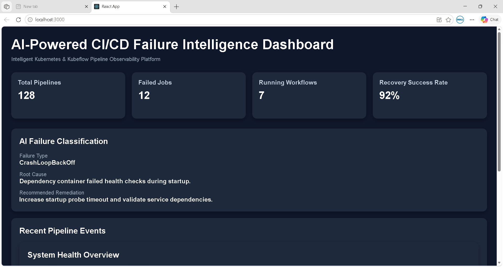

# AI-Powered CI/CD Failure Intelligence Dashboard

An intelligent observability dashboard designed to analyze Kubernetes and Kubeflow pipeline failures with structured failure classification, root-cause insights, and remediation recommendations.

---

# 🚀 Dashboard Preview

<p align="center">
  
</p>

This dashboard demonstrates a modern CI/CD observability interface for analyzing Kubernetes workflow failures and pipeline execution issues.

---

# ✨ Implemented Features

- Modern React-based CI/CD observability dashboard
- Kubernetes workflow failure visualization
- AI-inspired failure classification interface
- Root-cause analysis section
- Suggested remediation recommendations
- Pipeline monitoring metrics
- Responsive dashboard UI
- Kubeflow workflow observability prototype

---

# ⚙️ How It Works

1. User analyzes Kubernetes or pipeline failure logs
2. Dashboard classifies common failure categories
3. Root cause is identified using rule-based analysis
4. Suggested remediation steps are displayed
5. Pipeline health metrics are visualized

---

# 📊 Example Failure Classification

| Failure Type     | Root Cause                              | Suggested Fix                          |
| ---------------- | --------------------------------------- | -------------------------------------- |
| OOMKilled        | Memory limit exceeded                   | Increase Kubernetes memory limits      |
| CrashLoopBackOff | Dependency/service startup failure      | Validate startup dependencies          |
| ImagePullBackOff | Container image fetch failure           | Verify image registry access           |
| Unschedulable    | Insufficient cluster resources          | Scale cluster or reduce resource usage |

---

# 🧠 Project Motivation

Debugging failed Kubeflow pipelines and Kubernetes workloads often requires:

- Manual log inspection
- Understanding distributed system failures
- Tracing pod lifecycle states
- Navigating complex Kubernetes events

This project aims to simplify the debugging experience through structured failure visualization and intelligent remediation guidance.

---

# 🧩 Current Architecture

```text
React Frontend Dashboard
        ↓
Static Failure Classification Engine
        ↓
Root Cause Mapping
        ↓
Remediation Recommendation UI
```

---

# 📁 Project Structure

```text
AI-Powered-CI-CD-Failure-Intelligence-Dashboard/
│
├── public/
├── src/
├── architecture/
│   ├── kubeflow-workflow-analysis.md
│   └── failure-classification-engine.md
│
├── README.md
├── package.json
└── package-lock.json
```

---

# 🔧 Technology Stack

- React
- JavaScript
- CSS
- Kubernetes Concepts
- Kubeflow Pipelines
- CI/CD Workflows
- Observability Systems

---

# 🚀 Run Locally

```bash
npm install
npm start
```

Application runs on:

```text
http://localhost:3000
```

---

# 📌 Current Scope

This prototype currently focuses on:

- Frontend observability experience
- Kubernetes failure visualization
- Rule-based classification concepts
- Root-cause presentation
- Dashboard-oriented monitoring workflows

---

# 🔮 Planned Enhancements

- Real Kubernetes log ingestion
- Backend API integration
- AI/ML-assisted failure prediction
- Confidence scoring system
- Real-time pipeline monitoring
- Distributed tracing integration
- Advanced workflow analytics
- Historical failure trend analysis

---

# 📚 Kubeflow & Kubernetes Research

This repository also includes architectural exploration and workflow analysis related to Kubeflow Pipelines and Kubernetes execution systems.

Topics explored include:

- Workflow orchestration
- Driver execution lifecycle
- Pipeline request flow
- Pod lifecycle failures
- Distributed state consistency
- Observability limitations
- Failure visibility gaps

---

# 📖 Architecture Deep Dives

Planned analysis documents:

- `architecture/kubeflow-workflow-analysis.md`
- `architecture/failure-classification-engine.md`

These documents explain:

- Kubeflow execution flow
- Kubernetes workflow lifecycle
- Failure classification design
- Observability architecture concepts

---

# 🎯 Engineering Goals

This project aims to improve:

- Developer productivity
- Failure observability
- Kubernetes debugging workflows
- Pipeline failure understanding
- CI/CD monitoring experience

---

# ✅ Project Status

Current Status:

- Functional frontend prototype completed
- Dashboard UI implemented
- Failure classification interface implemented
- Root-cause recommendation workflow implemented
- Repository documentation improved

---

# 👤 Author

GitHub: https://github.com/RATNAPRADEEP
````
