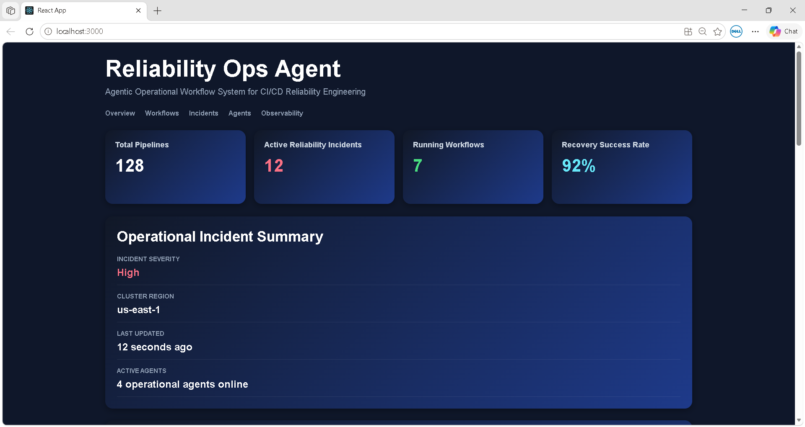
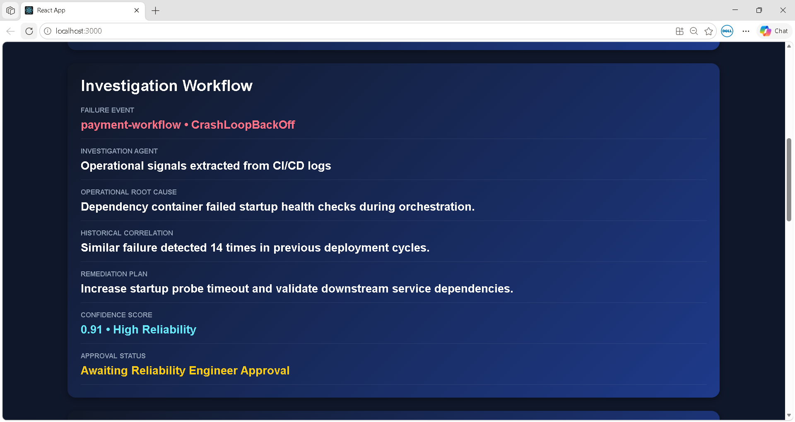
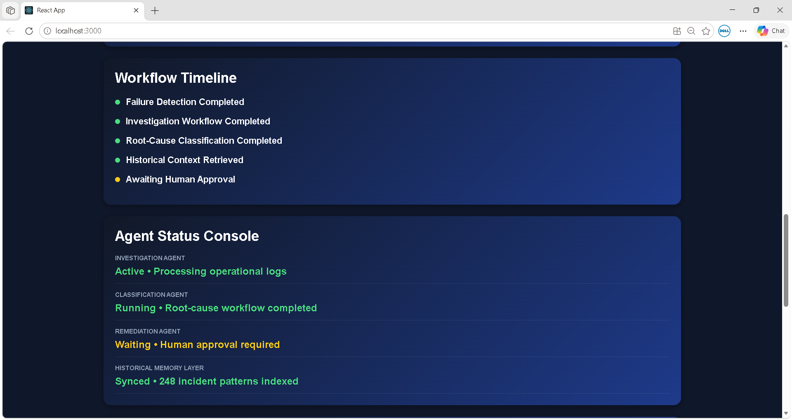

# Reliability Ops Agent

An agentic reliability operations platform for investigating CI/CD and Kubernetes workflow failures through operational reasoning, root-cause classification, remediation workflows, and observability intelligence.

---

## Live Demo

https://reliability-ops-agent.vercel.app

This dashboard demonstrates an operational reliability workflow interface for analyzing Kubernetes execution failures, CI/CD pipeline instability, and remediation planning workflows.

---

# 📸 Platform Preview

## Operational Console



---

## Investigation Workflow




## Workflow Timeline & Agent Console



---

# 🧠 Why Reliability Ops?

Modern CI/CD systems generate operational complexity across distributed infrastructure, Kubernetes workloads, deployment orchestration, and workflow execution systems.

Debugging failures often requires:

- Log correlation
- Infrastructure reasoning
- Historical context analysis
- Root-cause investigation
- Remediation planning
- Workflow observability

Reliability Ops Agent explores an agentic operational workflow for CI/CD reliability engineering where specialized agents investigate failures, classify operational issues, retrieve historical context, and assist remediation workflows while preserving human operational control.

---

# ⚙️ Operational Capabilities

- Agent-assisted CI/CD failure investigation
- Kubernetes workflow observability
- Structured root-cause classification
- Historical operational context retrieval
- Remediation workflow recommendations
- Confidence-aware operational reasoning
- Human-in-the-loop remediation approval design
- Pipeline health observability
- Reliability-oriented workflow visualization
- Failure trend exploration

---

# 🔄 Operational Workflow Lifecycle

```text
Pipeline Failure Event
        ↓
Failure Log Ingestion
        ↓
Investigation Agent
        ↓
Failure Classification
        ↓
Historical Context Correlation
        ↓
Root-Cause Reasoning
        ↓
Remediation Planning
        ↓
Confidence Evaluation
        ↓
Human Approval Workflow
        ↓
Reliability Metrics Storage
```

---

# 🧩 Agentic System Architecture

```text
CI/CD Pipeline Event
        ↓
Investigation Agent
        ↓
Classification Engine
        ↓
Historical Failure Memory
        ↓
Root-Cause Reasoning Layer
        ↓
Remediation Planning Agent
        ↓
Confidence Scoring
        ↓
Human Approval Workflow
        ↓
Observability + Reliability Metrics
```

---

# 🤖 Agent Responsibilities

## Investigation Agent

Responsible for ingesting CI/CD failure logs, extracting operational signals, identifying failure patterns, and generating structured investigation summaries for downstream remediation workflows.

---

## Classification Agent

Performs structured root-cause classification across infrastructure failures, dependency conflicts, flaky tests, deployment regressions, and configuration drift scenarios.

---

## Remediation Agent

Generates remediation workflows, retry strategies, rollback recommendations, and operational guidance based on failure context and historical reliability patterns.

---

# 📊 Example Failure Classification

| Failure Type     | Root Cause                           | Suggested Remediation                 |
| ---------------- | ------------------------------------ | ------------------------------------- |
| OOMKilled        | Memory limit exceeded                | Increase Kubernetes memory allocation |
| CrashLoopBackOff | Dependency/service startup failure   | Validate service dependencies         |
| ImagePullBackOff | Container image fetch failure        | Verify image registry authentication  |
| Unschedulable    | Insufficient cluster resources       | Scale cluster resources               |
| Config Drift     | Invalid runtime configuration        | Validate environment configuration    |
| Network Failure  | Registry or API connectivity timeout | Retry workflow and inspect network health |

---

# 🛡️ Operational Safety Design

The platform intentionally avoids fully autonomous infrastructure remediation for high-risk operational workflows.

Operational recommendations are confidence-scored and routed through human approval checkpoints before infrastructure-impacting actions are executed.

This design prioritizes:

- Operational trust
- Auditability
- Observability
- Controlled automation
- Reliability engineering safety

---

# 📈 Reliability & Observability Goals

The platform focuses on improving:

- Pipeline reliability visibility
- Kubernetes debugging workflows
- Operational investigation speed
- Failure observability
- Root-cause traceability
- Workflow intelligence
- CI/CD operational awareness

---

# 📁 Project Structure

```text
reliability-ops-agent/
│
├── public/
├── src/
├── agents/
│   ├── investigationAgent.js
│   ├── classificationAgent.js
│   └── remediationAgent.js
│
├── workflows/
│   └── failureWorkflow.js
│
├── observability/
│   ├── metrics.js
│   ├── pipelineHealth.js
│   └── failureTrends.js
│
├── memory/
│   └── historicalFailures.json
│
├── screenshots/
│   ├── dashboard-overview.png
│   ├── investigation-workflow.png
│   ├── workflow-timeline.png
│   └── agent-console.png
│
├── architecture/
│   ├── system-architecture.png
│   ├── workflow-lifecycle.png
│   ├── agent-flow.png
│   ├── kubeflow-workflow-analysis.md
│   └── failure-classification-engine.md
│
├── README.md
├── package.json
└── package-lock.json
```

---

# 🔧 Technology Stack

- React
- JavaScript
- CSS
- Kubernetes Concepts
- Kubeflow Pipelines
- CI/CD Workflows
- Reliability Engineering Concepts
- Observability Systems

---

# 🚀 Run Locally

```bash
npm install
npm start
```

Application runs on:

```text
http://localhost:3000
```

---

# 📌 Current Scope

Current implementation focuses on:

- Operational workflow orchestration concepts
- Kubernetes failure investigation workflows
- Agent-assisted root-cause analysis
- Remediation planning interfaces
- Observability-oriented reliability systems
- Workflow intelligence exploration

---

# 🚀 Roadmap

- Real-time Kubernetes log ingestion
- Stateful operational memory system
- Multi-agent investigation workflows
- Adaptive remediation planning
- Workflow replay system
- Historical failure intelligence
- Reliability scoring engine
- Autonomous low-risk remediation workflows
- GitHub Actions integration
- Slack/Teams operational alerting

---

# 📚 Kubeflow & Kubernetes Research

This repository also includes architectural exploration and workflow analysis related to Kubeflow Pipelines and Kubernetes execution systems.

Topics explored include:

- Workflow orchestration
- Driver execution lifecycle
- Pipeline request flow
- Pod lifecycle failures
- Distributed state consistency
- Observability limitations
- Failure visibility gaps
- Operational reliability workflows

---

# 📖 Architecture Deep Dives

Planned analysis documents:

- `architecture/kubeflow-workflow-analysis.md`
- `architecture/failure-classification-engine.md`

These documents explore:

- Kubeflow execution flow
- Kubernetes workflow lifecycle
- Failure classification systems
- Observability architecture concepts
- Reliability workflow reasoning
- Operational orchestration models

---

# 🎯 Engineering Goals

This project aims to improve:

- Reliability engineering workflows
- Operational debugging efficiency
- Failure investigation visibility
- CI/CD workflow understanding
- Infrastructure observability
- Agent-assisted operational workflows

---

# ✅ Project Status

Current Status:

- Functional frontend prototype completed
- Operational dashboard UI implemented
- Failure classification workflows implemented
- Root-cause recommendation interface implemented
- Repository architecture refactored
- Agent workflow structure introduced
- Workflow lifecycle visualization completed
- Human-in-the-loop remediation design implemented

---

# 👤 Author

GitHub: https://github.com/RATNAPRADEEP